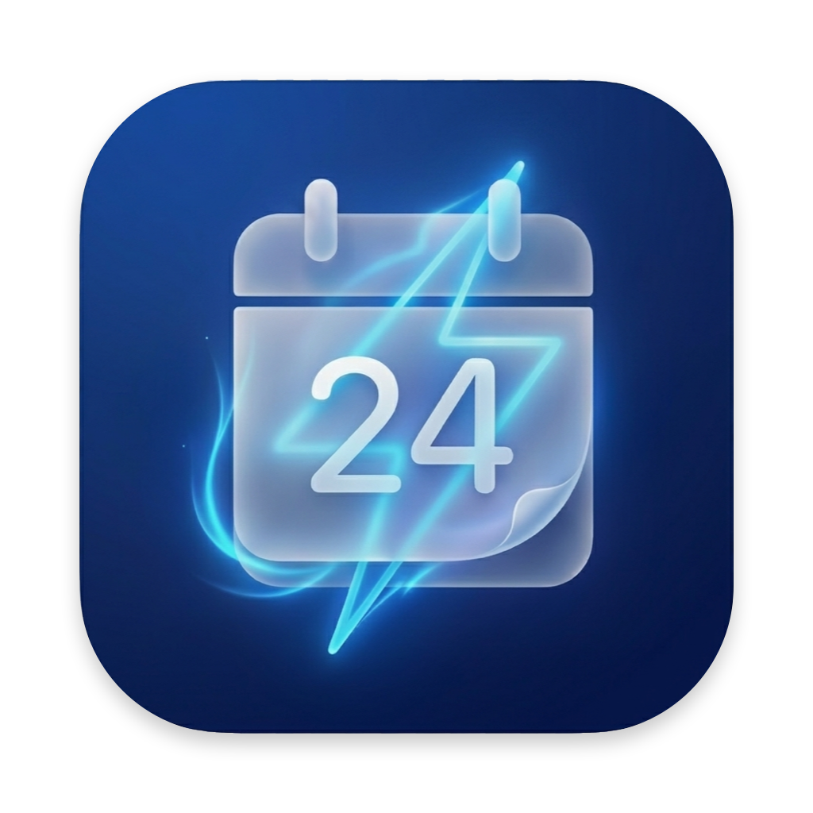

<div align="center">



# RON — Routine On

**Obsidian 주간 데일리 노트 자동화.** 매일 아침 같은 템플릿을 손으로 복사·붙여넣기 하던 일을 없앱니다.

[](LICENSE)


### [⬇️ RON.dmg 다운로드 (최신 릴리스)](https://github.com/hyunhwang-kurly/daily-note-automation/releases/latest/download/RON.dmg)

</div>

---

## ⬇️ 다운로드 & 설치 (비개발자용)

코드·터미널 없이 **3단계**면 끝납니다. (macOS Apple Silicon)

### 1. 다운로드
**[⬇️ RON.dmg 받기](https://github.com/hyunhwang-kurly/daily-note-automation/releases/latest/download/RON.dmg)** — 또는 [Releases 페이지](https://github.com/hyunhwang-kurly/daily-note-automation/releases/latest)에서 받기

### 2. 설치
1. 받은 `RON.dmg` 를 **더블클릭**해서 엽니다
2. 창에 나온 **`RON.app` 을 `응용 프로그램` 폴더로 드래그**합니다
3. `응용 프로그램`에서 RON을 **마우스 우클릭 → 열기 → (경고창에서) 열기** 한 번만 합니다
   > 미서명 앱이라 더블클릭하면 "확인되지 않은 개발자" 경고가 뜹니다. **첫 실행만 우클릭→열기**로 허용하면 이후엔 그냥 켜집니다.

### 3. 사용
1. 처음 켜면 **설정 마법사**가 뜹니다:
   - **노트 폴더 선택** (Obsidian 볼트 안의 데일리 노트 폴더)
   - **실행 시각** 입력 (기본 `07:00`)
   - (선택) **요약 메일** 받을 주소
   - **자동 실행 등록** → 이번 주 노트가 바로 생성됩니다
   - (선택) **로그인 시 자동 실행**
2. 끝! 상단 메뉴바에 **⚡ 아이콘**이 상주합니다. 클릭하면:
   - **오늘 노트 열기** · **설정** · **RON 종료**
   - **설정**을 누르면 **유리(글래스모피즘) 느낌의 설정 창**이 열립니다. 노트 폴더 · Obsidian 볼트명 · Personal 루틴 · 실행 시각 · 메일(on/off·주소) · 로그인 자동 실행을 **폼에서 한 번에 입력하고 "완료"** 로 저장 (코드 수정 불필요).
3. 매일 설정한 시각에 이번 주 노트가 자동으로 만들어지고, 어제 못 끝낸 할일이 오늘로 넘어옵니다.

### 꼭 필요한 것 / 선택
| | 항목 | 비고 |
| :-- | :-- | :-- |
| ✅ 필수 | macOS (Apple Silicon) | Intel 맥은 [소스 빌드](#%EF%B8%8F-빌드-appdmg)의 `--download` 사용 |
| ❌ 불필요 | **Node.js 설치** | **앱에 포함**되어 있어 따로 설치할 필요 없음 |
| 🔲 선택 | Obsidian | "오늘 노트 열기" 버튼으로 앱에서 바로 열 때 |
| 🔲 선택 | Mail.app (설정·온라인) | 요약 메일 기능을 켠 경우에만 |

---

## RON이 하는 일

매일 정해진 시각에 이번 주 노트를 만들고, 어제 끝내지 못한 할일을 오늘 칸으로 옮겨 적고, 원하면 요약 메일까지 보냅니다. macOS 메뉴바에 상주하는 작은 앱(🗓️/⚡)으로, 비개발자도 `.dmg` 하나로 설치할 수 있습니다.

## ✨ 기능

| | 기능 | 설명 |
| :-- | :-- | :-- |
| 📅 | **주간 노트 자동 생성** | ISO 주차 규칙으로 `YYYY/YYYY.MM/YYYY년 M월 N주차.md`를 폴더까지 자동 생성 |
| ↪ | **미완료 할일 이월** | 어제의 미완료 `- [ ]`를 오늘 Work 칸으로. 마커 없이 **원문 그대로 복붙**(중첩 탭/들여쓰기 보존) |
| ⏰ | **매일 자동 실행** | launchd로 지정 시각(기본 07:00) 실행. 잠자기였으면 깨어난 직후 보정 |
| 📧 | **요약 메일 (선택)** | 오늘 칸 + 이월 요약을 HTML 메일로. `데일리 노트 확인하기` 버튼은 **Gmail에서도 클릭**되는 https 링크(→ Obsidian 자동 실행) |
| 🤖 | **Claude Code 작업 로그** | 세션 작업을 요약해 노트에 기록하는 스킬 + 세션 종료 자동 트레이스 훅 |
| ⚡ | **메뉴바 앱** | 상단 상태표시줄 상주(Dock 미표시). 오늘 노트 열기 · 설정 · 종료. 로그인 자동 실행 |
| 🪟 | **글래스 설정 창** | 메뉴바 → 설정 → **글래스모피즘 폼**(`라벨: 입력칸`)에서 모든 설정을 한 번에 변경 (코드·터미널 불필요) |
| 🧱 | **Zero-dependency** | 외부 npm 의존성 0. 이월 로직은 결정론적(LLM 미사용)이라 오프라인·무료 |

## 🚀 빠른 시작

### 비개발자 — 앱으로 (`.dmg`)
1. **[⬇️ RON.dmg 다운로드](https://github.com/hyunhwang-kurly/daily-note-automation/releases/latest/download/RON.dmg)** → 열어서 **`RON.app` 을 응용 프로그램으로 드래그**
2. 첫 실행만 **우클릭 → 열기 → 열기** (미서명 앱 1회 허용)
3. 처음 켜면 뜨는 **설정 창**(유리 느낌의 폼)에서 노트 폴더·실행 시각·메일·로그인 자동 실행을 입력하고 **완료**
4. 끝. 메뉴바에 ⚡ 아이콘이 상주하고, 설정한 시각에 노트가 자동 생성됩니다. 이후 설정은 **⚡ → 설정**에서 언제든 변경.

### 개발자 — 소스로
```bash
git clone https://github.com/hyunhwang-kurly/daily-note-automation.git
cd daily-note-automation
nvm use                       # Node 22 (.nvmrc)
node --test                   # 테스트 48개

node bin/daily-note.js --dry  # 오늘 대상 파일 경로 확인
node bin/daily-note.js        # 오늘 노트 생성/이월 (+메일)
bash launchd/install.sh       # 매일 자동 실행 등록
```

## 📖 사용법

```bash
node bin/daily-note.js                  # 오늘 생성/이월 (+메일)
node bin/daily-note.js --date 2026-06-16  # 특정 날짜
node bin/daily-note.js --no-mail        # 메일 생략
node bin/daily-note.js --dry            # 대상 경로만 출력
node bin/daily-note.js open             # 오늘 노트를 Obsidian으로 열기
node bin/daily-note.js log "한 일1" "한 일2"   # 오늘 Work 칸에 작업 로그 추가
```

launchd 등록/해제:
```bash
bash launchd/install.sh            # 매일 지정 시각 실행
bash launchd/install.sh uninstall
bash launchd/install-login.sh      # 메뉴바 앱 로그인 자동 실행
```

## ⚙️ 설정

설정 우선순위: **환경변수 > `~/Library/Application Support/RON/config.json`(마법사 생성) > 기본값**

| 항목 | 기본값 | 환경변수 |
| :-- | :-- | :-- |
| 노트 볼트 루트 | iCloud Obsidian 경로 | `DAILY_NOTE_VAULT` |
| 실행 시각 | `07:00` | `DAILY_NOTE_HOUR` / `DAILY_NOTE_MINUTE` |
| 메일 수신자 | (마법사 입력) | `DAILY_NOTE_EMAIL_TO` |
| 메일 on/off | `on` | `DAILY_NOTE_EMAIL=off` |
| Obsidian 볼트명 | `.obsidian` 자동 탐지 | `DAILY_NOTE_OBSIDIAN_VAULT` |
| 메일 버튼 리다이렉트 | GitHub Pages `open.html` | `DAILY_NOTE_OBSIDIAN_WEBBASE` |
| Personal 루틴 | `운동`, `독서` | (config) |

> **메일 버튼이 Gmail에서 클릭되는 이유** — Gmail 등 웹메일은 보안상 `obsidian://` 같은 커스텀 스킴 링크를 막습니다. 그래서 `데일리 노트 확인하기` 버튼은 `https://…github.io/daily-note-automation/open.html?vault=…&file=…` 로 연결되고, 이 페이지가 `obsidian://`로 다시 넘겨 노트를 엽니다(브라우저에서 실행되므로 정상 동작). 이 리다이렉트 페이지는 **볼트/파일을 쿼리로 받는 범용 페이지**라 모든 사용자가 공유해 쓸 수 있습니다. 자체 호스팅을 쓰려면 `DAILY_NOTE_OBSIDIAN_WEBBASE`로 주소만 바꾸면 됩니다.

## 🧩 주차 계산 규칙 (ISO week-of-month)

> 한 주는 **월~일**, 그 주의 **목요일이 속한 달**이 소속 월.
> `N주차 = ceil(목요일의 일(日) / 7)` — 1일이 포함된 주가 아니라 4일 이상 포함된 주가 1주차.

한 주는 정확히 한 파일에만 속해 월말·연말 경계에서 중복/누락이 없습니다. 예) `6/29~7/5`(목 7/2) → `2026.07/2026년 7월 1주차.md`(폴더 자동 생성).

### 생성 예시
```markdown
## 화(6/16)
- Personal
	- [ ] 운동
	- [ ] 독서
- Read
- Work
	- [ ] 배포 요청서 작성
		- [ ] 리뷰 반영
	- 🤖 Claude Code
		- 14:30
			- daily-note에 log 명령 추가
```

## 🤖 Claude Code 연동

세션에서 한 작업을 오늘 노트에 기록합니다.

```bash
bash claude/install.sh               # /daily-log 스킬 등록
bash claude/install.sh --with-hook   # + 세션 종료 자동 트레이스 훅
```
- **스킬 `/daily-log`** — Claude가 세션 작업을 요약해 노트에 기록 (지능형)
- **SessionEnd 훅** — 세션 종료 시 `프로젝트·브랜치·변경수·최근 커밋` 한 줄 자동 기록 (무료·무재귀)

## 🏗️ 빌드 (`.app` / `.dmg`)

```bash
bash app/build-app.sh              # 현재 arch용 (로컬 node 복사)
bash app/build-app.sh --download   # arch별 node 내려받아 번들
# 산출물: dist/RON.app, dist/RON.dmg
```
- RON.app = **Swift 메뉴바 앱**(LSUIElement). Node 런타임 번들로 별도 설치 불필요.
- 아이콘: `app/icon.png`(1024 정사각, full-bleed) → `make-icon.swift`가 macOS 규격(둥근 사각형+투명 여백+그림자)으로 자동 변환.
- 미서명 배포(무료) — 첫 실행 우클릭→열기. Apple Developer 인증서가 있으면 `codesign`+공증으로 경고 제거.

## 🗂️ 구조

```
daily-note-automation/
├── bin/            # CLI 진입점 (daily-note.js, setup.js)
├── src/            # 코어 로직 (week·markdown·template·runner·email·worklog·config…)
├── test/           # node:test (48 케이스)
├── launchd/        # 자동 실행 등록 스크립트 (install.sh, install-login.sh)
├── app/            # macOS 앱 빌드 (RONMenuBar.swift, make-icon.swift, build-app.sh, icon.png)
├── claude/         # Claude Code 스킬/훅 + install.sh
├── docs/           # 메일 버튼용 https→obsidian:// 리다이렉트 (GitHub Pages)
└── assets/         # 로고 등
```

## 🛠️ 기술 스택

Node.js (ESM) · 내장 `node:test` · macOS launchd · Swift/AppKit(메뉴바 앱·아이콘) · 외부 의존성 0

## 🤝 Contributing

이슈/PR 환영합니다. 변경 전 `node --test`로 테스트가 통과하는지 확인해주세요. 코어 로직은 순수 함수로 분리해 테스트 가능하게 유지합니다. 설계 의도·동작 원리·구현 세부는 **[ARCHITECTURE.md](ARCHITECTURE.md)** 를 참고하세요.

## 📄 License

[MIT](LICENSE) © hyun hwang
